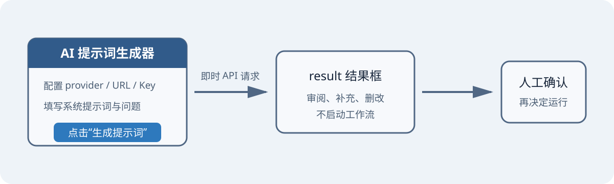
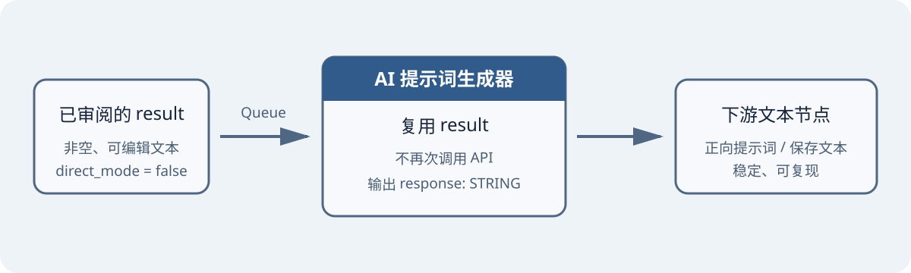
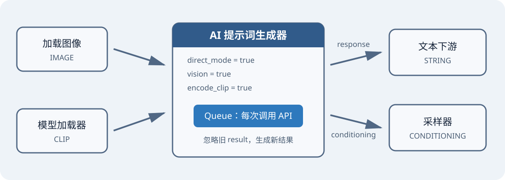

# ComfyUI AI Prompt

用于 ComfyUI 的 AI 提示词生成节点。它可以调用 OpenAI Responses、OpenAI Chat Completions、Anthropic Messages 或 LM Studio 兼容接口，生成可审阅、可编辑、可直接传给下游的文本提示词；也支持把生成结果编码为 `CONDITIONING`。

## 功能

- 在节点内调用大语言模型生成提示词，不必离开 ComfyUI。
- 支持 OpenAI Responses、OpenAI Chat、Anthropic Messages 与本地 LM Studio 兼容接口。
- 提供“即时生成并编辑”“审阅后运行”“直连自动生成”三种使用模式。
- 节点内可上传一张或多张图片，检测到图片后自动调用支持视觉输入的模型识图。
- 可输出普通 `STRING`，也可连接 `CLIP` 输出 `CONDITIONING`。
- 附带独立的“AI 提示词模板”节点，便于在工作流中复用系统提示词。

## 安装

### 方法一：ComfyUI Manager / Registry

在 ComfyUI Manager 中搜索 **AI Prompt**，安装后重启 ComfyUI。若尚未收录，请使用手动安装。

在插件尚未发布到 Registry 时，也可以在支持 Git URL 安装的 Manager 版本中选择 **Install via Git URL**，粘贴：

```text
https://github.com/Bigesila-B/comfyui_ai_prompt
```

安装完成后重启 ComfyUI。不同 Manager 版本的菜单位置可能不同；如果界面中没有 Git URL 安装入口，请使用下面的 Git 手动安装方式。

### 方法二：Git 手动安装

在 `ComfyUI/custom_nodes` 目录执行：

```bash
git clone https://github.com/Bigesila-B/comfyui_ai_prompt.git
cd comfyui_ai_prompt
python -m pip install -r requirements.txt
```

然后重启 ComfyUI。在节点菜单的 **AI 提示词** 分类中应能看到：

- `AI 提示词生成器`
- `AI 提示词模板`

> 如果使用 ComfyUI Portable，请用其内置 Python 安装依赖，例如：`python_embeded/python.exe -m pip install -r ComfyUI/custom_nodes/comfyui_ai_prompt/requirements.txt`。

## 三种使用模式

### 模式一：即时生成并编辑

设置接口与问题后，点击节点上的 **生成提示词**。结果会写入 `result`，不会启动整个工作流。你可以直接审阅和修改生成内容。



需要识图时，直接在节点的图片上传区添加一张或多张图片；未选择图片时自动使用纯文本模式。只上传图片而不填写 `question` 时，插件会自动使用默认识图提示词。

### 模式二：审阅后运行（推荐）

保持 `direct_mode = false`。先用 **生成提示词** 得到结果并编辑，再点击 ComfyUI 的 Queue/运行按钮。只要 `result` 非空，Queue 执行会直接复用该文本，不再次调用 API。



适合人工把关、固定提示词、减少重复 API 调用。若 `result` 为空，即使关闭直连模式，Queue 执行仍会调用 API 生成一次。

### 模式三：直连自动生成

设置 `direct_mode = true`，再点击 ComfyUI 的 Queue/运行按钮。每次执行都会忽略 `result` 中的旧内容，重新调用 API，并把新结果传给下游。节点图片上传区中的全部图片也会随请求发送。



适合自动化工作流与批处理。直连模式会禁用节点结果缓存，因此每次执行都可能产生 API 费用。

## 节点与参数

### AI 提示词生成器

| 参数 | 类型 | 说明 |
| --- | --- | --- |
| `provider` | 选项 | 接口协议：`OpenAI Responses`、`OpenAI Chat`、`Anthropic Messages`、`LM Studio Compatible`。 |
| `url` | STRING | API 根地址或完整端点。插件会按协议补全 `/responses`、`/chat/completions` 或 `/messages`。 |
| `api_key` | STRING | 服务密钥；无鉴权的本地服务可留空。输入框仅做密码遮罩。 |
| `model` | STRING | 服务端模型标识，不能为空，例如 `gpt-4o-mini`。 |
| `system_template` | STRING | 发送给模型的系统提示词。可由“AI 提示词模板”节点连接。 |
| `question` | STRING | 用户问题或提示词生成要求。只上传图片时可留空，会自动使用默认识图提示词。 |
| `result` | STRING | 可编辑的生成结果。非直连 Queue 会优先复用其中的非空文本。 |
| `encode_clip` | BOOLEAN | 是否把最终文本经 `clip` 编码为 `CONDITIONING`。 |
| `direct_mode` | BOOLEAN | 是否在每次 Queue 执行时强制重新调用 API。 |
| 图片上传区 | 内置控件 | 可添加一张或多张图片；有图片时自动启用视觉请求，清空后恢复纯文本模式。 |
| `clip` | CLIP，可选 | `encode_clip = true` 时必接，否则执行会报错。 |

输出：

- `response`：生成或复用的 `STRING`。
- `conditioning`：启用 `encode_clip` 后的 `CONDITIONING`；否则为 `None`。

### AI 提示词模板

| 参数 | 说明 |
| --- | --- |
| `note` | 仅用于整理工作流，不参与 API 请求。 |
| `template` | 输出为 `system_template` 的系统提示词模板。 |

## API 配置

| 服务 | `provider` | `url` 示例 | `api_key` |
| --- | --- | --- | --- |
| OpenAI Responses API | `OpenAI Responses` | `https://api.openai.com/v1` | 必填 |
| OpenAI Chat Completions | `OpenAI Chat` | `https://api.openai.com/v1` | 必填 |
| Anthropic Messages | `Anthropic Messages` | `https://api.anthropic.com/v1` | 必填 |
| LM Studio / OpenAI 兼容服务 | `LM Studio Compatible` | `http://127.0.0.1:1234/v1` | 通常留空，按服务配置 |

`url` 可以填写根地址，也可以直接填写完整端点。请确保 `provider` 与服务实际协议一致；“OpenAI 兼容”通常表示 Chat Completions 协议，不代表支持 OpenAI Responses API。

使用远程或反向代理服务时，请从服务提供方获取准确的 URL、模型 ID、鉴权方式及视觉能力。当前版本不提供代理、自定义请求头、采样参数或多轮上下文配置。

## 安全提示

- `api_key` 会随节点参数保存在 ComfyUI 工作流 JSON/PNG 元数据中；密码输入框只遮挡界面显示，不等于加密存储。
- 不要公开、提交或分享含真实密钥的工作流、截图、日志或导出的图片元数据。
- 建议使用权限最小、可撤销、设置额度上限的独立密钥；泄露后立即吊销并轮换。
- 插件会将图片编码后发送到所选 API。不要向不受信任的第三方服务发送私密、敏感或无授权图片。
- 异常信息会尝试隐藏完整密钥，但上游服务、代理、ComfyUI 日志或浏览器工具仍可能记录请求信息。
- 只使用可信 HTTPS 远程端点。本机 LM Studio 可使用 `127.0.0.1`；不要把无鉴权的本地服务暴露到公网。

## 故障排查

### 找不到节点

确认仓库目录为 `ComfyUI/custom_nodes/comfyui_ai_prompt`，其中直接包含 `__init__.py`；安装依赖后完整重启 ComfyUI，并查看启动日志中的导入错误。

### `No module named requests/PIL/numpy`

必须使用启动 ComfyUI 的同一个 Python 环境安装 `requirements.txt`。Portable 用户通常需要使用 `python_embeded/python.exe`。

### HTTP 401 / 403

检查密钥是否有效、有权限且未包含多余空格；确认 `provider` 与服务协议匹配。Anthropic 使用 `x-api-key`，其他支持项使用 Bearer token。

### HTTP 404

检查 `url`。可填写 API 根地址或对应完整端点，但不要重复路径。例如根地址应为 `https://api.openai.com/v1`，而不是同时重复拼接两次 `/v1`。

### 模型或问题不能为空

`model` 必须包含非空文本。模型 ID 必须与服务端提供的名称完全一致。`question` 在有图片时可留空，插件会自动使用默认识图提示词。

### 图片没有发送给模型

确认节点图片上传区显示的图片数量大于零，并且所选模型与接口支持视觉输入。即时生成按钮和 Queue 执行都会读取同一图片列表。

### `CLIP input is required when encode_clip is enabled`

开启 `encode_clip` 后必须把模型加载器的 `CLIP` 输出连接到本节点的 `clip` 输入；不需要条件输出时关闭该参数。

### Queue 没有重新请求 API

关闭直连模式且 `result` 非空时，节点会复用结果。清空 `result`，或开启 `direct_mode` 后再次运行。

### 超时或连接失败

确认网络、代理、防火墙和服务状态；本地 LM Studio 需已启动服务器并加载模型。单次请求超时为 120 秒。

## 发布到 Comfy Registry

仓库已经包含 `pyproject.toml`、`.comfyignore` 和手动发布工作流。维护者首次发布前需要完成以下一次性设置：

1. 登录 [Comfy Registry](https://registry.comfy.org/) 并创建 Publisher。
2. Publisher ID 必须与 `pyproject.toml` 中的 `PublisherId = "Bigesila-B"` 完全一致；如果实际创建了其他 ID，请先修改该字段。
3. 在 Registry 创建发布 API Key。
4. 在 GitHub 仓库的 `Settings > Secrets and variables > Actions` 中新建仓库 Secret：`REGISTRY_ACCESS_TOKEN`。
5. 打开 GitHub 仓库的 `Actions > Publish to Comfy Registry`，选择 `Run workflow`。

成功发布后，用户可以在支持 Registry 的 ComfyUI Manager 中搜索节点名称安装，无需手动填写 GitHub 地址。后续发布新版时先更新 `pyproject.toml` 的语义化版本号，再手动运行发布工作流。

## 许可证

本项目使用 [MIT License](LICENSE)。
